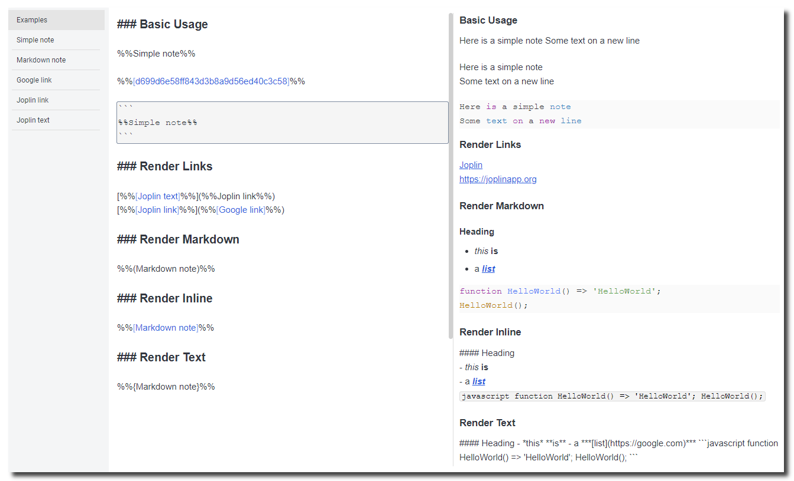

# Tokenized Notes for Joplin

[](https://github.com/njobnz/joplin-plugin-tokenized-notes/releases/latest)
[](https://github.com/njobnz/joplin-plugin-tokenized-notes/actions/workflows/test.yml)
[](https://opensource.org/licenses/MIT)

A plugin for Joplin that enables referencing content from other notes using placeholder tokens.



## Usage

### Referencing Notes

To reference the content of another note, use the following syntax:

```
%%Title of Another Note%%
```

This will display the content of the note titled "**Title of Another Note**" in the markdown viewer.

Alternatively, reference a note using its ID:

```
%%4a7fbc2e5d9a36e10cf8b4d7ea12c390%%
```

### Renderer Tags

Tokens can include rendering tags to control content display:

| Token Syntax  | Description                     |
| ------------- | ------------------------------- |
| `%%Token%%`   | Use the default renderer.       |
| `%%(Token)%%` | Render markdown content.        |
| `%%[Token]%%` | Render markdown inline.         |
| `%%{Token}%%` | Render as plain text (default). |

#### Example:

- `%%(Note with Markdown)%%` will render the markdown content of the note.
- `%%{Plain Text Note}%%` will display the raw text of the note.

### Autocomplete

Typing the opening tag (%%) triggers a dropdown menu listing available note titles. Selecting a title will autocomplete the token.

## Settings

| Setting                          | Default | Description                                                                                                                                                                             |
| -------------------------------- | ------- | --------------------------------------------------------------------------------------------------------------------------------------------------------------------------------------- |
| Autocomplete                     | Yes     | Display a dropdown of token suggestions in the editor when the opening tag is entered.                                                                                                  |
| Code blocks only                 | No      | Only replace tokens found in fenced code blocks (\`\`\`).                                                                                                                               |
| Note IDs only                    | No      | Allow only note IDs to be used as tokens.                                                                                                                                               |
| Tag filter                       |         | Restrict token titles to notes with the specified tag name. Notes without this tag can still be referenced by ID.                                                                       |
| Token prefix                     | %%      | Opening tag for tokens. (default: %%)                                                                                                                                                   |
| Token suffix                     | %%      | Closing tag for tokens. (default: %%)                                                                                                                                                   |
| Always replace in code blocks    | Yes     | Automatically replace tokens in fenced code blocks (\`\`\`). To enable token replacement for a specific block, write \`tokenized\` in the header.                                       |
| Always render markdown (caution) | No      | Always render markdown found in referenced notes without using ( ) tags. Markdown is not rendered in code blocks. *This feature is highly experimental and may cause rendering issues.* |

## Installation
<!--
### Automatic

- Open Joplin and navigate to **Tools > Options > Plugins**.
- Search for **"Tokenized Notes"** and click **Install**.
- Restart Joplin to enable the plugin.
-->
### Manual

- Download the latest `.jpl` file from [releases](https://github.com/njobnz/joplin-plugin-tokenized-notes/releases/latest).
- Open Joplin and navigate to **Tools > Options > Plugins**.
- Click the gear icon and select **Install from file**.
- Choose the downloaded `.jpl` file and restart Joplin.

## Known issues and limitations

- **Switching Notes:** Tokens may not update immediately when switching between notes. Editing the note usually triggers the tokens to render.
- **Token Naming:** Token names cannot contain characters reserved for the opening and closing tags, or have spaces at the beginning or end. Use note ID tokens to reference notes with titles that include reserved characters.
- **Duplicate Titles:** Only the last note found with a duplicate title is used. To avoid ambiguity, reference notes with duplicate titles using their unique note ID.
- **Nested Tokens:** Nested token replacement is not supported.

## Acknowledgments

This plugin is inspired by and builds upon features from the following projects:

- [Note Variables Plugin](https://github.com/DanteCoder/JoplinPluginNoteVariables)
- [Joplin Extract Paragraphs](https://github.com/djsudduth/joplin-plugin-paragraph-extractor)
- [Joplin Note Link System](https://github.com/ylc395/joplin-plugin-note-link-system)
- [Quick Links Plugin for Joplin](https://github.com/roman-r-m/joplin-plugin-quick-links)
- [Embed search in note](https://github.com/ambrt/joplin-plugin-embed-search)

## License

This project is licensed under the [MIT License](LICENSE.md). See `LICENSE.md` for details.
